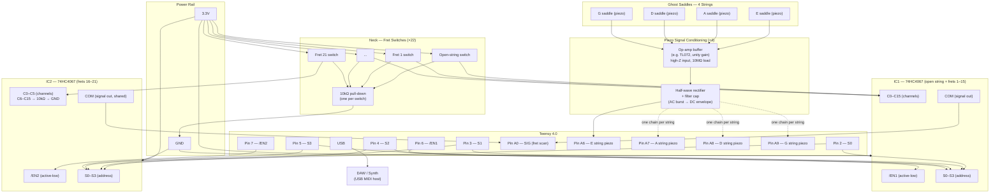

# Hardware Schematic

```mermaid
graph TD
    subgraph POWER["Power Rail"]
        V33["3.3V"]
        GND["GND"]
    end

    subgraph NECK["Neck — Fret Switches (×22)"]
        direction TB
        SW0["Open-string switch"]
        SW1["Fret 1 switch"]
        SWDOT["..."]
        SW21["Fret 21 switch"]
        PD["10kΩ pull-down\n(one per switch)"]
        V33 --> SW0 & SW1 & SWDOT & SW21
        SW0 & SW1 & SWDOT & SW21 --> PD --> GND
    end

    subgraph IC1["IC1 — 74HC4067 (open string + frets 1–15)"]
        IC1_EN["/EN1 (active-low)"]
        IC1_ADDR["S0–S3 (address)"]
        IC1_CH["C0–C15 (channels)"]
        IC1_COM["COM (signal out)"]
    end

    subgraph IC2["IC2 — 74HC4067 (frets 16–21)"]
        IC2_EN["/EN2 (active-low)"]
        IC2_ADDR["S0–S3 (address)"]
        IC2_CH["C0–C5 (channels)\nC6–C15 → 10kΩ → GND"]
        IC2_COM["COM (signal out, shared)"]
    end

    subgraph PIEZO["Ghost Saddles — 4 Strings"]
        PS_E["E saddle (piezo)"]
        PS_A["A saddle (piezo)"]
        PS_D["D saddle (piezo)"]
        PS_G["G saddle (piezo)"]
    end

    subgraph AMP["Piezo Signal Conditioning (×4)"]
        BUF["Op-amp buffer\n(e.g. TL072, unity gain)\nhigh-Z input, 10MΩ load"]
        RECT["Half-wave rectifier\n+ filter cap\n(AC burst → DC envelope)"]
        BUF --> RECT
    end

    subgraph TEENSY["Teensy 4.0"]
        T_S0["Pin 2 — S0"]
        T_S1["Pin 3 — S1"]
        T_S2["Pin 4 — S2"]
        T_S3["Pin 5 — S3"]
        T_EN1["Pin 6 — /EN1"]
        T_EN2["Pin 7 — /EN2"]
        T_SIG["Pin A0 — SIG (fret scan)"]
        T_A6["Pin A6 — E string piezo"]
        T_A7["Pin A7 — A string piezo"]
        T_A8["Pin A8 — D string piezo"]
        T_A9["Pin A9 — G string piezo"]
        T_USB["USB"]
    end

    DAW["DAW / Synth\n(USB MIDI host)"]

    %% Fret switch → mux channels
    SW0 --> IC1_CH
    SW1 --> IC1_CH
    SWDOT --> IC1_CH
    SW21 --> IC2_CH

    %% Teensy → mux control
    T_S0 --> IC1_ADDR & IC2_ADDR
    T_S1 --> IC1_ADDR & IC2_ADDR
    T_S2 --> IC1_ADDR & IC2_ADDR
    T_S3 --> IC1_ADDR & IC2_ADDR
    T_EN1 --> IC1_EN
    T_EN2 --> IC2_EN

    %% Mux signal → Teensy
    IC1_COM --> T_SIG
    IC2_COM --> T_SIG

    %% Piezo chain
    PS_E & PS_A & PS_D & PS_G --> BUF
    RECT --> T_A6
    RECT -.->|"one chain per string"| T_A7 & T_A8 & T_A9

    %% Power to muxes
    V33 --> IC1 & IC2
    GND --> IC1 & IC2

    %% USB out
    T_USB --> DAW
```
