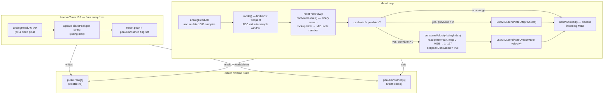
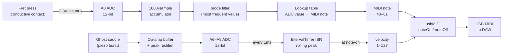

# Software Architecture

## Component Overview



## Timing Diagram

```mermaid
sequenceDiagram
    participant Timer as IntervalTimer (1ms)
    participant Peak as piezoPeak[]
    participant Loop as Main Loop
    participant MIDI as USB MIDI

    Note over Timer,Peak: String is plucked
    Timer->>Peak: analogRead → store max (burst captured over ~10–50ms)
    Timer->>Peak: analogRead → no change (peak already higher)
    Timer->>Peak: analogRead → no change

    Note over Loop: 1000-sample fret window completes
    Loop->>Loop: mode() → noteFromRaw() → currNote changed
    Loop->>MIDI: sendNoteOff(prevNote)
    Loop->>Peak: consumeVelocity() — read peak, map to 1–127
    Peak-->>Loop: velocity value
    Loop->>Peak: set peakConsumed = true
    Loop->>MIDI: sendNoteOn(currNote, velocity)

    Note over Timer,Peak: Next tick — ISR sees peakConsumed, resets piezoPeak to 0
    Timer->>Peak: reset → 0
```

## Data Flow


